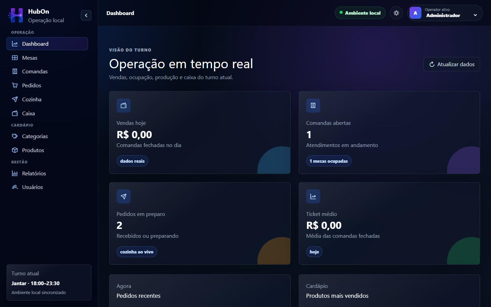
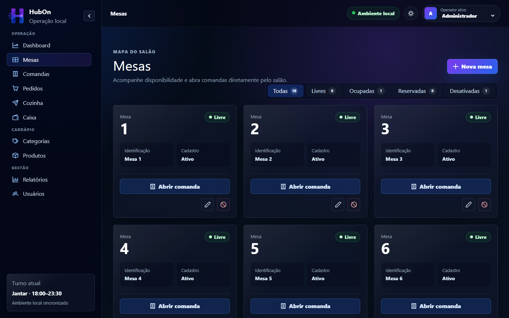
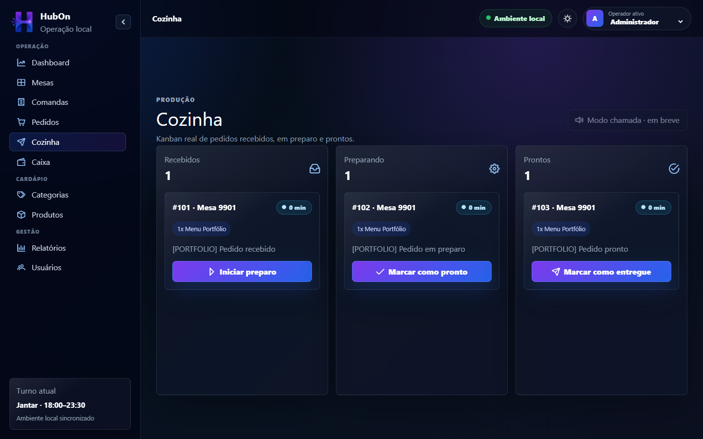
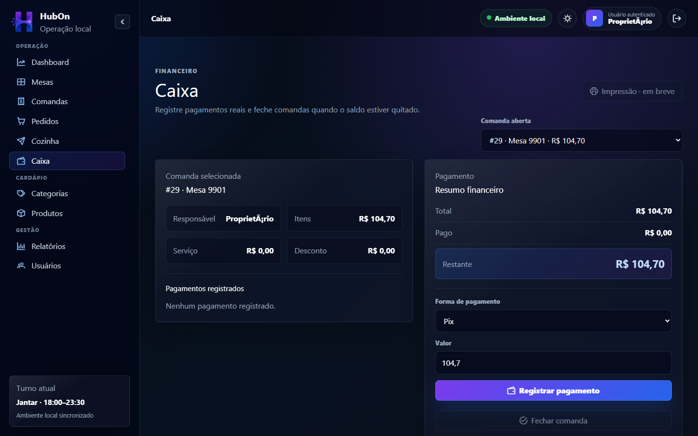

# HubOn

Sistema local para gerenciamento da operação de restaurantes, cobrindo o fluxo
completo de atendimento:

**Mesa → Comanda → Pedido → Itens do pedido → Pagamento**

O projeto foi construído como um MVP funcional e estudável, com frontend e
backend integrados em um monorepo.

## Objetivo

Centralizar a operação do salão, cozinha e caixa em uma interface única. O
HubOn permite acompanhar mesas, comandas, pedidos, produção e pagamentos sem
depender de serviços externos.

## Stack

**Backend**

- Java 21
- Spring Boot 4
- Spring Data JPA
- Spring Security
- PostgreSQL
- Flyway
- Maven Wrapper
- Lombok

**Frontend**

- Angular 21
- TypeScript
- Angular Router
- Tailwind CSS
- PrimeIcons
- RxJS

## Funcionalidades do MVP

- Dashboard operacional com atualização periódica.
- Cadastro e ativação de categorias e produtos.
- Gestão de mesas livres, reservadas, ocupadas e desativadas.
- Abertura, consulta, fechamento e cancelamento de comandas.
- Criação de pedidos com snapshots de nome e preço.
- Fluxo de cozinha em etapas.
- Registro de pagamentos e cálculo do saldo da comanda.
- Login JWT com roles `OWNER`, `ADMIN`, `WAITER`, `KITCHEN` e `CASHIER`.
- Autoria das operações pelo usuário autenticado.
- Cadastro de usuários com hierarquia de permissões.
- Relatórios operacionais básicos.
- Temas dark e light.
- Layout responsivo com sidebar recolhível.

## Demonstração visual

### Dashboard



### Mesas



### Cozinha



### Caixa



[Assistir à demonstração navegável em WebM](docs/media/videos/hubon-demo.webm)

As dez telas documentadas e as instruções para regenerar as mídias estão em
[portfolio-media.md](docs/portfolio-media.md).

## Estrutura do repositório

```text
HubOn/
├── backend/    API Spring Boot, regras de negócio e migrations
├── frontend/   aplicação Angular
└── docs/       documentação funcional e técnica
```

## Pré-requisitos

- Java 21 ou superior compatível com o projeto.
- Node.js e npm.
- PostgreSQL em execução.
- Banco `hubon_db` e usuário local configurados.

O perfil local usa, por padrão:

```text
Banco: hubon_db
Usuário: hubon_user
Senha: hubon_password
```

Esses valores podem ser substituídos por variáveis de ambiente.

Usuários locais seedados para desenvolvimento:

```text
OWNER: definido por hubon.seed.owner.*
ADMIN: definido por hubon.seed.admin.*
```

Os valores padrão do perfil local ficam em
`backend/src/main/resources/application-local.properties` e podem ser
substituídos por variáveis de ambiente, como `HUBON_SEED_OWNER_EMAIL`,
`HUBON_SEED_OWNER_PASSWORD`, `HUBON_SEED_ADMIN_EMAIL` e
`HUBON_SEED_ADMIN_PASSWORD`. As senhas são gravadas com BCrypt. Troque esses
valores e `HUBON_JWT_SECRET` fora do desenvolvimento local.

## Como executar

### Backend

```powershell
cd backend
.\mvnw.cmd spring-boot:run
```

A API fica disponível em `http://localhost:8080/api`.

### Frontend

Em outro terminal:

```powershell
cd frontend
npm install
npm start
```

A interface fica disponível em `http://localhost:4200`.

Para acesso por outro computador da rede:

```powershell
npm run start:network
```

Consulte [deployment-local.md](docs/deployment-local.md) antes de liberar portas
ou configurar o CORS.

## Como testar

Backend:

```powershell
cd backend
.\mvnw.cmd test
```

Frontend:

```powershell
cd frontend
npm test -- --watch=false
npm run build
```

Para validar o produto manualmente, siga
[manual-test-flow.md](docs/manual-test-flow.md). O roteiro cobre a jornada de
uma mesa livre até o fechamento da comanda e sua volta ao estado Livre.

## Status atual

O fluxo operacional principal está funcional e integrado à API. As regras
financeiras críticas, transições operacionais, consistência de mesas e regras de
segurança por perfil possuem testes no backend. O frontend possui build validado
e rotas protegidas por perfil.

Este projeto ainda é um MVP para uso local ou em rede privada confiável. Já há
JWT e autorização por perfil, mas ainda não há refresh token, política de senha,
auditoria completa nem hardening para internet pública.

Consulte [status-mvp.md](docs/status-mvp.md) para o detalhamento completo.

## Fora do MVP

- Delivery e integrações com marketplaces.
- WhatsApp e QR Code.
- Nota fiscal e integração com maquininha.
- Estoque avançado.
- Aplicativo mobile.
- Multiempresa e multiunidade.
- WebSocket.
- Exportação de relatórios e impressão parcial.

## Roadmap pós-MVP

1. Adicionar refresh token, troca de senha e política de tentativas.
2. Isolar ambientes de teste com banco dedicado.
3. Ampliar testes do frontend e adicionar testes end-to-end.
4. Criar paginação navegável e filtros por período.
5. Adicionar observabilidade, auditoria e estratégia de backup.
6. Preparar implantação segura com TLS, proxy reverso e gestão de segredos.

## Documentação

- [Arquitetura](docs/architecture.md)
- [Modelo de banco](docs/database-model.md)
- [Endpoints](docs/endpoints.md)
- [Regras de negócio](docs/regras-negocio.md)
- [Fluxo do sistema](docs/fluxo-sistema.md)
- [Integração frontend/API](docs/frontend-api-integration.md)
- [Execução local e em rede](docs/deployment-local.md)
- [Testes](docs/testing.md)
- [Notas de segurança](docs/security-notes.md)
- [Checklist de release](docs/release-checklist.md)
- [Status do MVP](docs/status-mvp.md)
- [Roteiro de teste manual](docs/manual-test-flow.md)
- [Branding](docs/branding.md)
- [Temas](docs/frontend-theme.md)
- [Mídias do portfólio](docs/portfolio-media.md)
