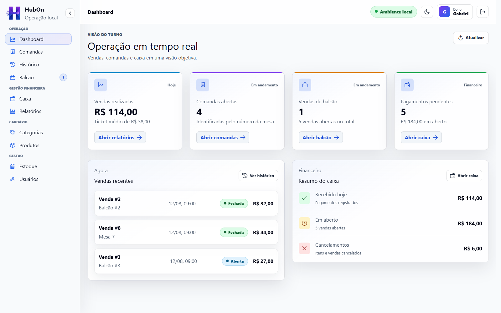
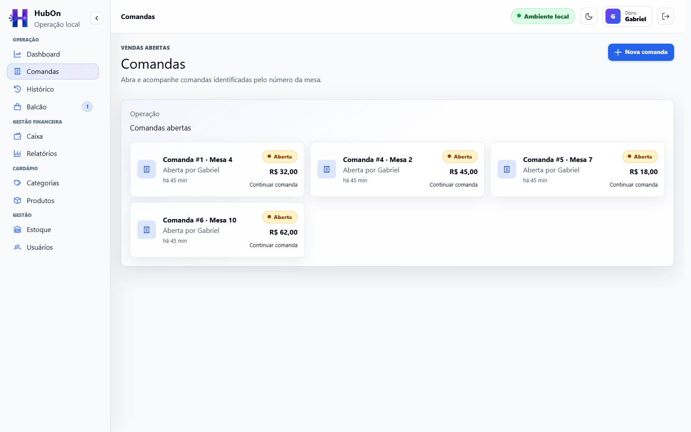
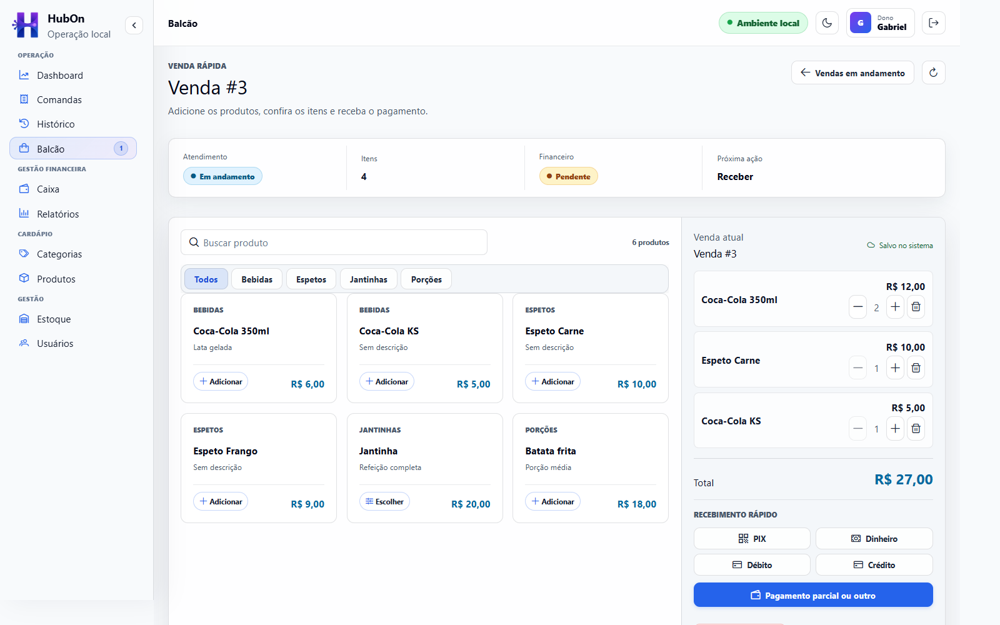
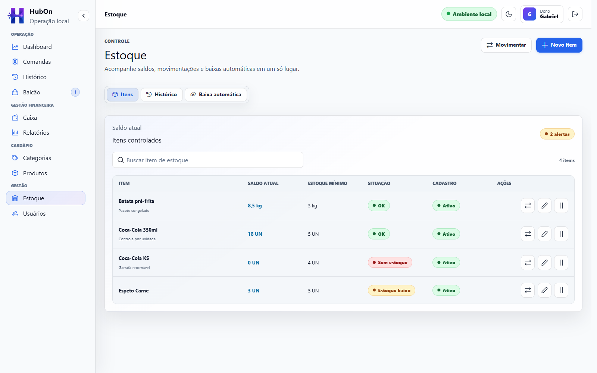
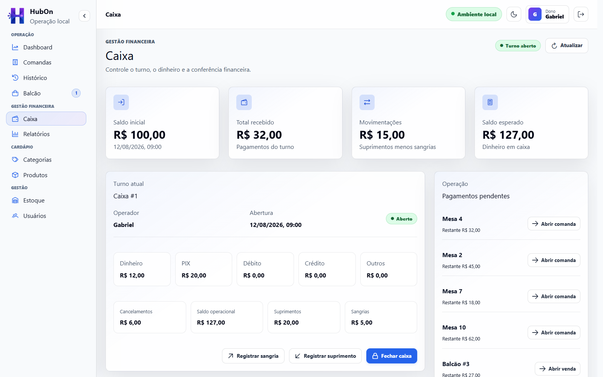
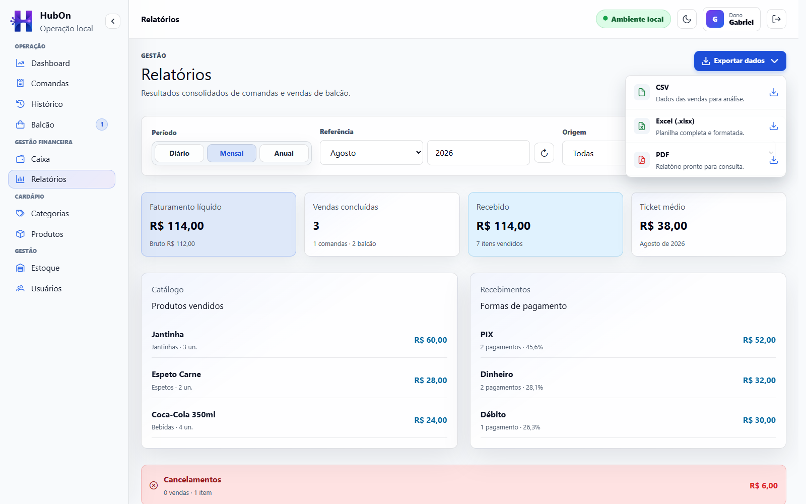

# HubOn

O HubOn é um sistema interno de gestão para restaurantes. Ele foi desenhado para
o dono ou gerente controlar a operação diária com poucos cliques: comandas por
número de mesa, vendas de balcão, catálogo, estoque, caixa, relatórios e usuários.

O produto não é um cardápio para consumidores e não possui fluxo de produção.
Cada lançamento já faz parte da venda, e a operação financeira e o estoque são
registrados com histórico auditável.

## Funcionalidades atuais

- **Dashboard:** vendas do dia, atendimentos abertos, pendências e resumo do caixa.
- **Comandas:** vendas `TABLE` identificadas pelo número informado para a mesa.
- **Balcão:** vendas `COUNTER` com inclusão rápida de produtos e recebimento.
- **Histórico:** consulta de vendas fechadas ou canceladas.
- **Categorias e Produtos:** catálogo simples, preços e escolhas opcionais.
- **Estoque:** saldos, alertas, movimentações e baixas automáticas.
- **Caixa:** abertura, recebimentos, suprimentos, sangrias e conferência.
- **Relatórios:** períodos diário, mensal e anual, com filtro por origem.
- **Usuários e Minha Conta:** acesso por nome de usuário e troca de senha.

## Visão do sistema

### Dashboard

Resumo do movimento atual e atalhos para as áreas operacionais.



### Comandas e Balcão

Atendimentos rápidos, com catálogo, itens e valores no mesmo espaço de trabalho.





### Estoque e Caixa

Controle dos saldos físicos e da conferência financeira do turno.





### Relatórios

Indicadores por período e origem, com exportação em CSV, XLSX e PDF.



## Arquitetura

```text
Angular 21 -> HTTP/JSON -> Spring Boot 4 / Java 21 -> JPA -> PostgreSQL 16
```

A execução local recomendada usa Docker Compose com três serviços: frontend,
backend e PostgreSQL. O frontend publica `http://localhost:4200` e encaminha
`/api` ao backend dentro da rede Docker.

## Instalação no Windows

Pré-requisitos:

- Windows 10 ou 11;
- Docker Desktop com Docker Compose;
- PowerShell executado como administrador;
- arquivo `.env` configurado a partir de `.env.example`, sem valores de exemplo.

No diretório do repositório:

```powershell
Copy-Item .env.example .env
notepad .env
PowerShell -ExecutionPolicy Bypass -File .\scripts\install-hubon-windows.ps1
```

O instalador copia o sistema para `C:\HubOn`, preserva um `.env` já existente,
valida a configuração, cria as imagens, registra a inicialização automática e
cria um atalho para o HubOn. Os detalhes estão em
[Instalação no Windows](docs/deployment/windows-installation.md).

## Execução para desenvolvimento

Com toda a stack em Docker:

```powershell
docker compose -f docker-compose.yml -f docker-compose.dev.yml up -d --build
```

O complemento de desenvolvimento publica também o PostgreSQL em `5432` e o
backend em `8080`, sempre vinculados a `127.0.0.1`.

Para executar frontend e backend diretamente, consulte
[Execução local](docs/deployment/deployment-local.md).

## Testes e build

Backend:

```powershell
cd backend
.\mvnw.cmd clean verify
```

Frontend:

```powershell
cd frontend
npm ci
npm test -- --watch=false
npm run build
```

A captura visual documental usa `playwright-core` apenas como automação de
navegação e screenshots. Ela não é uma suíte E2E:

```powershell
cd frontend
npm run visual:audit
```

## Segurança e dados

- O login usa nome de usuário e senha; o backend normaliza o identificador.
- A API usa JWT stateless e aplica autorização no servidor.
- Senhas são armazenadas com BCrypt.
- Segredos pertencem ao `.env`, que não deve ser versionado.
- O volume `hubon_postgres_data` preserva o banco quando containers são recriados.
- Nunca use `docker compose down -v` ou comandos de limpeza de volumes em uma
  atualização normal.

Consulte [Segurança](docs/security/security.md) e
[Atualização do HubOn](docs/deployment/updating-hubon.md).

## Documentação

O [índice da documentação](docs/README.md) reúne arquitetura, regras de negócio,
API, banco, implantação, homologação e decisões arquiteturais.
