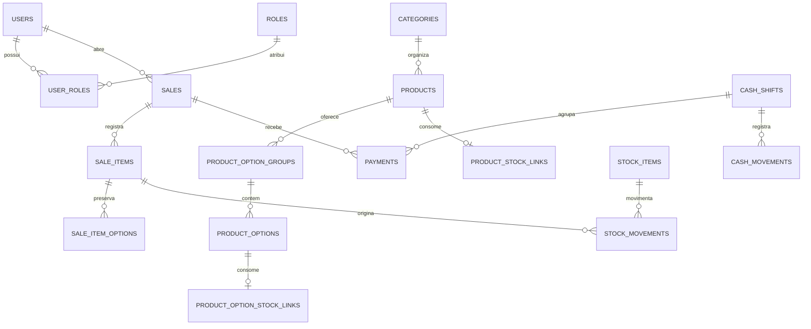

# Modelo de dados e migrations

O PostgreSQL é evoluído pelo Flyway. O Hibernate usa `ddl-auto=validate`: ele
valida as entidades contra o esquema e não cria tabelas automaticamente.

## Relações principais

## Tabelas

### Identidade

- `roles`: perfis cadastrados.
- `users`: nome, `username` único sem diferença entre maiúsculas/minúsculas,
  senha BCrypt, atividade e timestamps.
- `user_roles`: associação entre usuários e perfis.

O banco exige `username` normalizado no formato `[a-z0-9._-]{3,40}`.

### Catálogo

- `categories`: nome, atividade e ordem.
- `products`: categoria opcional, nome, descrição, preço, atividade,
  disponibilidade e ordem.
- `product_option_groups`: produto, nome, mínimo/máximo, atividade e ordem.
- `product_options`: grupo, nome, preço adicional, atividade e ordem.

Preços não podem ser negativos. O mínimo de escolhas não pode superar o máximo.

### Vendas

- `sales`: tipo, número de mesa opcional, cliente opcional, estado, taxa,
  desconto e autoria de abertura/fechamento/cancelamento.
- `sale_items`: produto, snapshots comerciais, quantidade, subtotal, autoria e
  estados de remoção ou cancelamento.
- `sale_item_options`: escolha opcional e snapshots do grupo, nome e adicional.
- `payments`: venda, turno de caixa, forma, valor, data e responsável.

Uma venda é `TABLE` ou `COUNTER`; o estado é `OPEN`, `CLOSED` ou `CANCELLED`.
Somente `TABLE` aceita `table_number`, e um índice parcial garante um único
número de mesa aberto. Quantidades e pagamentos são positivos. Remoção e
cancelamento de item são estados terminais mutuamente exclusivos.

Os totais da venda não são persistidos: são calculados a partir de itens ativos,
taxa, desconto e pagamentos.

### Caixa

- `cash_shifts`: abertura, saldo inicial, fechamento, esperado, contado,
  diferença e observação.
- `cash_movements`: suprimentos e sangrias vinculados ao turno.

Um índice parcial permite somente um turno `OPEN`. Valores de abertura e
contagem não podem ser negativos; movimentos manuais precisam ser positivos.

### Estoque

- `stock_items`: unidade, saldo atual, mínimo e atividade.
- `product_stock_links`: consumo automático por unidade vendida do produto.
- `product_option_stock_links`: consumo automático por escolha selecionada.
- `stock_movements`: ledger com delta, saldos anterior/resultante, origem,
  estorno, motivo, autoria e data.

Saldos não podem ser negativos. Índices parciais garantem no máximo um vínculo
automático ativo por produto e por escolha.

## Migrations atuais

| Arquivo | Conteúdo |
| --- | --- |
| `V1__initial_schema.sql` | baseline do domínio simplificado: identidade, catálogo, vendas, caixa e estoque |
| `V2__seed_roles.sql` | carga idempotente dos perfis estruturais |
| `V3__allow_sale_quantity_stock_deltas.sql` | múltiplos deltas e estornos de estoque por item de venda |
| `V4__add_product_option_stock_links.sql` | vínculo de estoque para escolhas de produto |
| `V5__replace_user_email_with_username.sql` | autenticação por nome de usuário normalizado |
| `V6__add_sale_item_removal_state.sql` | remoção auditável de item, separada de cancelamento |

Não existe migration `V7` ou posterior na `main` documentada aqui.

## Evolução segura

- Nunca altere uma migration já publicada.
- Mudanças de esquema entram em um novo arquivo versionado.
- Não use `repair` para mascarar checksum incompatível.
- Não apague o volume do PostgreSQL em atualizações normais.
- Recriar um banco é uma ação excepcional para ambiente descartável e exige
  backup e confirmação explícita.
