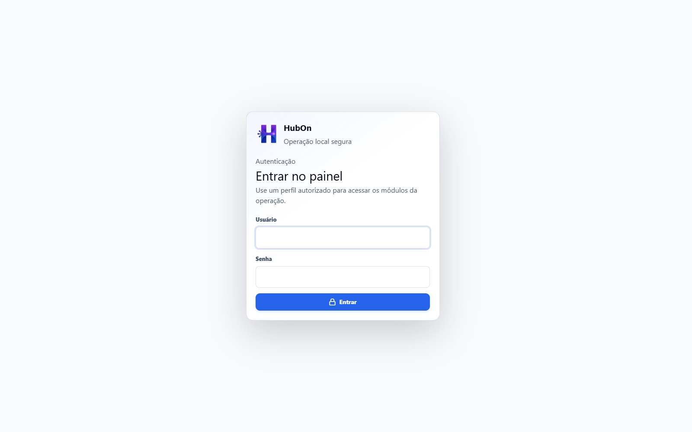
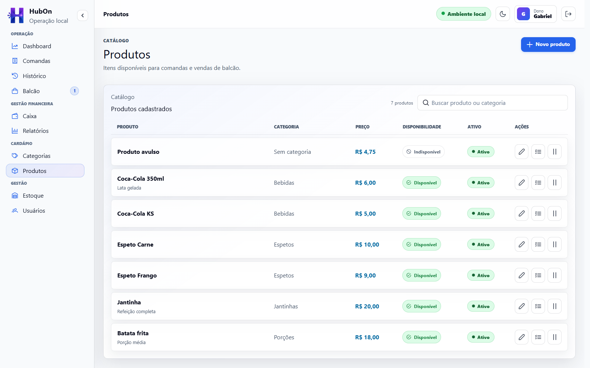

# Capturas do HubOn

As imagens documentais mostram a interface atual com dados fictícios e
determinísticos. Elas são geradas em `1600x1000`, sem moldura artificial, tokens,
senhas, configurações ou dados pessoais reais.

## Seleção versionada

```text
docs/media/screenshots/
|-- login.png
|-- dashboard.png
|-- comandas.png
|-- balcao.png
|-- produtos.png
|-- estoque.png
|-- caixa.png
`-- relatorios.png
```

O README usa uma seleção dessas telas. Todas permanecem disponíveis para
documentos e apresentação do projeto.

## Telas documentadas

### Login

Acesso interno por nome de usuário e senha, sem dados preenchidos na captura.



### Dashboard

Resumo do movimento, atendimentos abertos e situação financeira do turno.


### Comandas

Comandas abertas identificadas pelo número informado para cada mesa.


### Balcão

Venda rápida com produtos lançados e formas de recebimento disponíveis.


### Produtos

Catálogo atual com categoria opcional, preço, disponibilidade e situação.



### Estoque

Saldos físicos, limites mínimos e alertas de reposição.


### Caixa

Turno aberto com recebimentos, movimentações e saldo esperado.


### Relatórios

Consolidação mensal por origem e menu atual de exportação.


## Geração

Com dependências instaladas e o frontend atual em execução:

```powershell
cd frontend
npm run visual:audit
```

O script usa `playwright-core` apenas para navegação e captura. As respostas da
API são controladas e seguem os DTOs atuais. A saída temporária fica em
`frontend/dist/visual-audit`; somente as oito imagens revisadas são copiadas para
o diretório documental.

Essa automação não é teste E2E. Ela não instala um test runner, não altera banco
e não valida transições de negócio.

## Dados demonstrativos

- Dono `Gabriel` e Gerente `Maria`;
- Comanda da Mesa 4;
- venda de Balcão com produtos;
- catálogo com bebidas, espetos e jantinhas;
- estoque normal e com alerta;
- caixa aberto com pagamentos, suprimento e sangria;
- relatório mensal com vendas das duas origens.

## Revisão antes de publicar

- página, título e menu corretos;
- dados coerentes com o domínio atual;
- sem erro HTTP, loading permanente, overflow ou sobreposição;
- sem tooltip ou menu acidental, salvo o menu de exportação exibido para
  documentar os formatos atuais;
- sem informação sensível;
- texto legível no GitHub;
- nomes e resolução consistentes.
